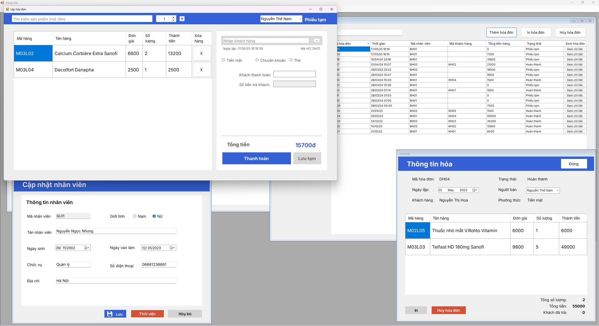

# Quản Lý Bán Thuốc (Pharmacy Management System)

Đây là một ứng dụng Windows Forms được phát triển bằng C# để quản lý một hiệu thuốc. Ứng dụng cho phép quản lý nhân viên, mặt hàng (thuốc), khách hàng, và hóa đơn bán hàng.

## Tính năng chính

*   **Quản lý Nhân viên:**
    *   Thêm, sửa, xóa thông tin nhân viên.
    *   Tìm kiếm và lọc danh sách nhân viên.
    *   Quản lý trạng thái làm việc của nhân viên.
*   **Quản lý Mặt hàng (Thuốc):**
    *   Thêm, sửa, xóa thông tin mặt hàng.
    *   Quản lý số lượng, đơn giá, hạn sử dụng, nhà sản xuất.
    *   Tìm kiếm và lọc mặt hàng.
*   **Quản lý Khách hàng:**
    *   Lưu trữ thông tin khách hàng.
    *   Tìm kiếm khách hàng.
*   **Quản lý Hóa đơn:**
    *   Tạo hóa đơn bán hàng mới.
    *   Thêm, xóa các mặt hàng trong hóa đơn.
    *   Tính tổng tiền, tiền thối lại cho khách.
    *   Lưu tạm hoặc thanh toán hóa đơn.
    *   In hóa đơn (sử dụng Crystal Reports).
    *   Xem lại, sửa, hủy hóa đơn đã tạo.
    *   Lọc hóa đơn theo trạng thái, thời gian.
*   **Báo cáo:**
    *   Tạo báo cáo hóa đơn (rptHoaDon).

## Công nghệ sử dụng

*   Ngôn ngữ: C#
*   Giao diện: Windows Forms
*   Cơ sở dữ liệu: SQL Server 
*   Báo cáo: Crystal Reports

## Cài đặt

1.  **Yêu cầu:**
    *   .NET Framework
    *   SQL Server
    *   Crystal Reports Runtime (nếu chạy ứng dụng đã build trên máy không có Crystal Reports Developer)
2.  **Cấu hình cơ sở dữ liệu:**
    *   Chạy Scrpit SQL `SQL.sql` 
    *   Mở file `App.config`.
    *   Chỉnh sửa chuỗi kết nối `db_qlthuoc` để trỏ đến instance SQL Server của bạn và cơ sở dữ liệu tương ứng.
    *   Đảm bảo cơ sở dữ liệu có các bảng và stored procedures như được sử dụng trong code (ví dụ: `tblNhanVien`, `tblMatHang`, `tblHoaDon`, `tblChiTietHoaDon`, `UP_ThemHoaDon`, v.v.).
3.  **Build dự án:**
    *   Mở file `BTL_QuanLyBanThuoc.sln` bằng Visual Studio.
    *   Build dự án.

